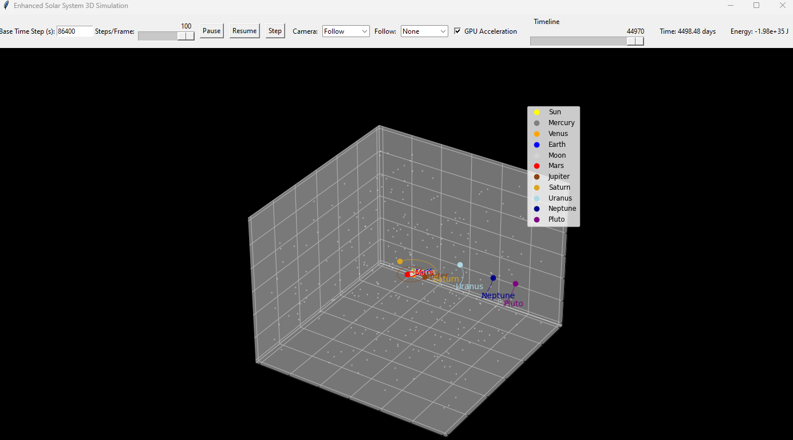

# SolarSim

## Overview

This project is an advanced 3D simulation of the solar system, featuring enhanced physics and interactive visualization. It simulates the motion of celestial bodies—including the Sun, eight planets, Earth's Moon, and Pluto—using a velocity Verlet integrator with adaptive time-stepping, relativistic corrections (for Mercury), and basic collision detection. The simulation is visualized in 3D using Matplotlib and controlled via a Tkinter GUI, which offers real-time parameter adjustments, timeline scrubbing, and multiple camera views.

<p align="center" width="100%">

</p>

## Features

- **Advanced Physics & Numerical Methods**
  - **Velocity Verlet Integration:** A symplectic integrator for improved long-term energy conservation.
  - **Adaptive Time-Stepping:** Automatically adjusts the time step based on inter-body distances.
  - **Relativistic Corrections:** A simple correction for Mercury’s perihelion precession.
  - **Collision Detection:** Merges bodies when they come within a specified proximity.
- **Expanded Celestial Model**

  - Includes the Sun, Mercury, Venus, Earth, Moon, Mars, Jupiter, Saturn, Uranus, Neptune, and Pluto.
  - Uses approximate orbital data; can be enhanced with precise astronomical data (e.g., via AstroPy).

- **User Interactivity & Control**

  - Real-time adjustments for time step, simulation speed (steps per frame), and body-specific parameters.
  - Multiple camera modes: Free, Follow, and Top-Down views.
  - Timeline slider for scrubbing and replaying simulation trajectories.
  - Real-time data overlays for simulation time (in days) and total energy.
  - Placeholder toggle for GPU acceleration.

- **Visualization Enhancements**
  - 3D visualization with a star-filled background.
  - Labels and trajectory paths for each celestial body.
  - Interactive navigation toolbar (zoom, pan, rotate).

## Requirements

- **Python 3.x**
- **Required Python Packages:**
  - [NumPy](https://numpy.org/)
  - [Matplotlib](https://matplotlib.org/)
  - [Tkinter](https://docs.python.org/3/library/tkinter.html) (usually included with Python)
  - [Numba](http://numba.pydata.org/)
- **Optional for Packaging:**
  - [PyInstaller](https://www.pyinstaller.org/) for creating standalone executables

## Installation

1. **Clone the Repository:**

   ```bash
   git clone https://github.com/yourusername/enhanced_solar_system.git
   cd enhanced_solar_system
   ```

2. **Install Dependencies:**

Use pip to install the necessary packages:

```bash
pip install numpy matplotlib numba
```

## Running the Simulation

To run the simulation, execute the main script:

```bash
python enhanced_solar_system.py
```

### Controls

- **Base Time Step (s):** Adjusts the simulation's base time step (default is 86,400 seconds = 1 day).
- **Steps/Frame:** Sets the number of simulation steps executed per animation frame.
- **Pause/Resume/Step:** Control the simulation flow.
- **Camera Modes:** Choose between Free, Follow (centers on a selected body), or Top-Down views.
- **Timeline Slider:** Scrub through the simulation timeline to replay trajectories.
- **GPU Acceleration:** (Placeholder) Toggle for potential future GPU support.
- **Data Overlays:** View real-time simulation time and total energy.

## Packaging as a Standalone Application

To create a standalone executable using PyInstaller, follow these steps:

1. **Install PyInstaller:**

   ```bash
   pip install pyinstaller

   ```

2. **Package the Application:**

Run the following command in your project directory:

```bash
pyinstaller --onefile --windowed enhanced_solar_system.py
```

3. **Locate the Executable:**

The packaged executable will be located in the dist folder.

### Project Structure

```bash
enhanced_solar_system/
├── enhanced_solar_system.py # Main simulation script
├── README.md # Project documentation
├── .gitignore # Git ignore rules (e.g., /dist, /build folders)
└── build_app.sh / build_app.bat # Build scripts for packaging
```

## Contributing

Contributions are welcome! If you’d like to enhance the simulation further, please follow these steps:

1. Fork the repository.
2. Create a new branch for your feature or bugfix.
3. Make your changes with clear commit messages.
4. Open a pull request explaining your changes.

Feel free to suggest improvements in areas such as numerical methods, physics enhancements, visualization, or performance optimization.

## License

This project is licensed under the MIT License. See the LICENSE file for details.
