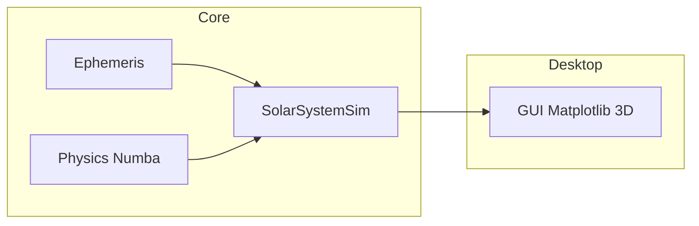

<div align="center">

<pre>
##############################################################################################
#                                                                                            #
#                         ____        _               ____  _                                #
#                        / ___|  ___ | | __ _ _ __   / ___|(_)_ __ ___                       #
#                        \___ \ / _ \| |/ _` | '__|  \___ \| | '_ ` _ \                      #
#                         ___) | (_) | | (_| | |      ___) | | | | | | |                     #
#                        |____/ \___/|_|\__,_|_|     |____/|_|_| |_| |_|                     #
#                                                                                            #
#                                                                                            #
##############################################################################################

</pre>
  
</div>

<p align="center">
  <strong>Three-dimensional N-body solar system simulation for the desktop</strong>
</p>

<p align="center">
  <a href="https://github.com/fraware/solarsim/actions/workflows/ci.yml"></a>
  <a href="https://github.com/fraware/solarsim/blob/master/LICENSE"></a>
  
  <a href="https://github.com/fraware/solarsim"></a>
</p>

---

SolarSim integrates the major bodies of the solar system with **velocity Verlet** steps, an **adaptive timestep**, and a **Numba-accelerated** gravity kernel. You steer the run from a **Tkinter** window: Matplotlib draws trajectories in 3D, while sliders and camera modes keep exploration fluid. The core physics lives in plain Python modules, so you can script experiments or swap initial conditions without touching the UI.

<p align="center">
  <a href="https://github.com/fraware/solarsim"><b>github.com/fraware/solarsim</b></a>
</p>

---

## Highlights

| | |
|:---|:---|
| **Fidelity where it counts** | Symplectic-style Verlet integration, softening for close approaches, optional **illustrative** Mercury tweak (not full GR). |
| **Performance** | Hot loop JIT-compiled; trajectory buffers capped so long runs stay responsive. |
| **Interaction** | Pause, single-step, scrub the timeline, follow a planet, or pull back for a top-down view. |
| **Extensibility** | Headless `SolarSystemSim`; optional **AstroPy** ephemeris via an extra install. |

---

## Architecture


```mermaid
flowchart LR
  subgraph core [Core]
    E[Ephemeris]
    P[Physics Numba]
    S[SolarSystemSim]
  end
  subgraph surface [Desktop]
    G[GUI Matplotlib 3D]
  end
  E --> S
  P --> S
  S --> G
```

The GUI imports the simulator only; **simulation code does not depend on Tk or Matplotlib**, which keeps tests fast and CI headless.

---

## Quick start

```bash
git clone https://github.com/fraware/solarsim.git
cd solarsim
pip install -e .
python -m solarsim
```

Prefer the entry script after install: `solarsim`. For a checkout without `pip install -e .`, you can still run `python solar_system_simulation_3D.py` (it adds `src` to the module path).

**Developers** usually install tooling as well:

```bash
pip install -e ".[dev]"
```

---

## Requirements

- **Python** 3.11 or newer  
- **Runtime:** NumPy, Matplotlib, Numba (versions in [`pyproject.toml`](pyproject.toml))  
- **Tkinter:** Ships with many CPython builds on Windows and macOS; on Linux, install your distro’s Tk binding (e.g. Debian/Ubuntu: `python3-tk`)

---

## Using the application

The control bar drives integration rate, playback, viewpoint, and history.

<details>
<summary><b>Control reference</b> (click to expand)</summary>

| Control | What it does |
|:--------|:-------------|
| **Base Time Step (s)** | Nominal step in seconds (default 86 400 = one day). Adaptive logic scales around this within a fixed band. |
| **Steps / Frame** | Integration substeps per animation frame while running (1–100). |
| **Pause · Resume · Step** | Pause freezes time; **Step** advances exactly one integration step while paused. |
| **Camera** | **Free** — default bounds; **Follow** — frame a chosen body; **Top-Down** — overhead view. |
| **Follow** | Body tracked in Follow mode (ignored when set to `None`). |
| **Timeline** | Jump backward and forward along stored positions; resume to continue from the latest index. |
| **Overlays** | Elapsed time in days and total mechanical energy. |
| **Toolbar** | Standard Matplotlib tools for zoom, pan, and 3D rotation. |

</details>

---

## Python API

**Built-in approximate solar system:**

```python
from solarsim.simulation import SolarSystemSim

sim = SolarSystemSim(base_dt=86_400)
sim.step()
```

**Ephemeris from AstroPy** (after `pip install 'solarsim[astropy]'`):

```python
from solarsim.ephemeris import create_bodies_astropy
from solarsim.simulation import SolarSystemSim

bodies = create_bodies_astropy("2020-01-01")
sim = SolarSystemSim(86_400, body_factory=lambda: bodies)
```

The Mercury correction is documented on `SolarSystemSim` in [`src/solarsim/simulation.py`](src/solarsim/simulation.py); treat it as educational, not astrometric-grade.

---

## Development and CI

```bash
ruff check src tests
ruff format --check src tests   # or: ruff format src tests
mypy src
pytest
```

Set `MPLBACKEND=Agg` when no display is available (tests, SSH, CI). On Windows PowerShell: `$env:MPLBACKEND="Agg"`.

Pull requests run [**CI**](.github/workflows/ci.yml) on Ubuntu and Windows (Python 3.11 and 3.12): Ruff, Mypy, Pytest. [**Release**](.github/workflows/release.yml) can produce a Windows PyInstaller binary on tags or manual dispatch.

Contributor workflow: [**CONTRIBUTING.md**](CONTRIBUTING.md).

---

## Packaging

```bash
pip install pyinstaller
pyinstaller solarsim.spec
```

Output lands in `dist/` (e.g. `solarsim.exe` on Windows). Helpers: [`build_app.bat`](build_app.bat), [`build_app.sh`](build_app.sh).

---

## Repository layout

```text
solarsim/
├── src/solarsim/
│   ├── constants.py       # Physical constants
│   ├── body.py            # State and trajectory ring
│   ├── ephemeris.py       # Defaults + optional AstroPy
│   ├── physics_numba.py   # JIT accelerations
│   ├── simulation.py      # Integrator, collisions, energy
│   └── gui/app.py         # Tk + Matplotlib front end
├── tests/
├── pyproject.toml
├── solarsim.spec
├── LICENSE
├── README.md
└── CONTRIBUTING.md
```

---

<details>
<summary><b>Troubleshooting</b></summary>

| Symptom | What to try |
|:--------|:------------|
| `_tkinter` missing | Install Tk for your Python (e.g. `python3-tk`). |
| Tests or imports want a display | Export `MPLBACKEND=Agg` before running pytest or scripts. |
| Editable install errors | Confirm Python ≥ 3.11, upgrade `pip`, run from the repo root. |
| PyInstaller runtime gaps | Build on the target OS; read the PyInstaller log for missing hooks or DLLs. |

</details>

---

## Contributing and license

Improvements are welcome: fork the repo, open a PR, and follow [**CONTRIBUTING.md**](CONTRIBUTING.md).

Released under the **MIT License** — see [**LICENSE**](LICENSE).
